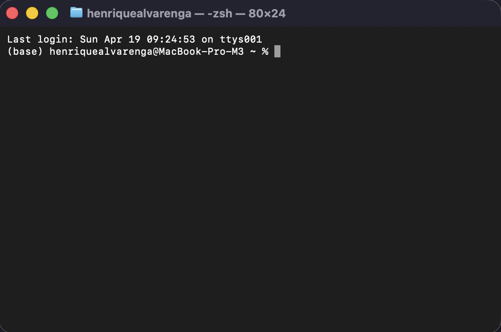
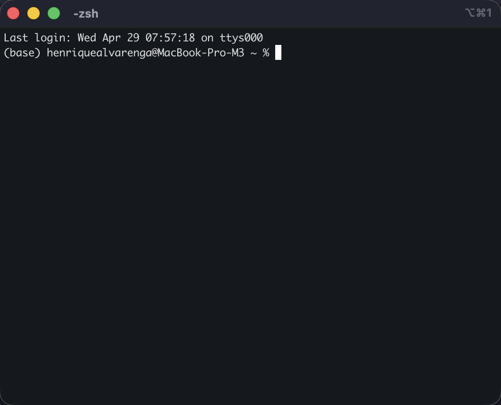

Tendo entendido o que é terminal e o que é shell, hora de abrir um. Vou mostrar como fazer no Mac e no Windows, e — depois — desenvolver o que aquele texto que aparece na tela significa.

## No Mac

Existem três caminhos para abrir o Terminal:

1. **Spotlight**: pressione `Cmd + Espaço`, digite "Terminal" e pressione Enter. É o mais rápido e o que vai usar com mais frequência.
2. **Finder**: vá em Aplicativos → Utilitários → Terminal.
3. **Launchpad**: abra o Launchpad e procure por Terminal na pasta "Outros".

Ao abrir, você verá uma janela com um prompt parecido com:

```
seu-usuario@seu-mac ~ %
```

Esse prompt indica que o terminal está pronto para receber comandos. A próxima seção explica o que cada parte significa.

{fig-alt="Janela do aplicativo Terminal no macOS mostrando o prompt do shell zsh."}

**Alternativa: iTerm2.** Além do Terminal padrão, vale conhecer o **iTerm2** [@iterm2], um emulador de terminal gratuito e mais completo, popular entre desenvolvedores no Mac. Oferece recursos que o Terminal padrão não tem: abas e painéis divididos lado a lado, busca dentro do histórico, autocompletar inteligente, paleta de comandos, e temas customizáveis. Para o curso, qualquer um dos dois funciona — se você for usar terminal de forma intensa, vale a instalação. Disponível em [iterm2.com](https://iterm2.com).

{fig-alt="Janela do iTerm2 no macOS mostrando interface com tema customizado."}

## No Windows

O Windows oferece diferentes opções, com perfis distintos:

**Prompt de Comando (`cmd`).** O interpretador clássico, herança do MS-DOS. Para abrir:

1. Pressione `Win + R`, digite `cmd` e pressione Enter.
2. Ou pesquise "Prompt de Comando" no menu Iniciar.

**PowerShell.** Shell moderno da Microsoft, com sintaxe própria mais poderosa (orientada a objetos). Para abrir:

1. Clique com o botão direito no menu Iniciar e selecione "Windows PowerShell".
2. Ou pesquise "PowerShell" no menu Iniciar.

**Windows Terminal (recomendado).** Aplicativo moderno que **unifica `cmd`, PowerShell e Git Bash em uma única interface** com abas, atalhos de teclado e suporte adequado a caracteres especiais (incluindo acentuação). É o caminho recomendado pela Microsoft hoje. Pode ser instalado gratuitamente pela Microsoft Store, ou já vem pré-instalado em versões recentes do Windows 11.

**Git Bash.** Quando você instala o Git para Windows, ele inclui o Git Bash — um emulador de terminal que **permite usar comandos no estilo Unix/Mac dentro do Windows**. Especialmente útil para seguir tutoriais que assumem bash/zsh, sem precisar traduzir cada comando. Se você instalou o Git seguindo o capítulo de instalação (M0-B1-06), já tem o Git Bash disponível.

## No Linux

Em qualquer distribuição Linux, o atalho de teclado padrão `Ctrl + Alt + T` abre o emulador de terminal. O nome do aplicativo varia (GNOME Terminal, Konsole, xfce4-terminal, etc.), mas o comportamento é praticamente idêntico ao do Terminal do Mac — comandos, sintaxe e estrutura do prompt seguem o mesmo padrão.

## Anatomia do prompt

Aquele texto que aparece antes do cursor não é decoração — cada parte tem significado. No Mac/Linux, o padrão típico é:

```
henrique@MacBook-Pro ~ %
```

| Parte | O que significa |
|---|---|
| `henrique` | Nome de usuário ativo no sistema |
| `@MacBook-Pro` | Nome da máquina (relevante quando você loga em um servidor remoto) |
| `~` | **Diretório atual** — o `~` é abreviação para a pasta home do usuário (`/Users/henrique` no Mac) |
| `%` | Indica que o prompt é zsh (no bash seria `$`) |

Quando você digitar `cd Documents` e pressionar Enter, o `~` vai virar `~/Documents`, ou seja, o prompt mostra **onde você está** a cada momento. Esse é o primeiro hábito útil do terminal: olhar o prompt antes de rodar comandos. Não é frescura — é o que evita rodar `rm` na pasta errada.

::: {.callout-tip}
## Personalizar o prompt
O prompt é configurável (variável `PS1` no bash, `PROMPT` no zsh) e pode mostrar branch atual do Git, hora, tempo de execução do último comando, e quase qualquer coisa que você queira. Frameworks populares como **oh-my-zsh** ([ohmyz.sh](https://ohmyz.sh)) e **Starship** ([starship.rs](https://starship.rs)) automatizam esse tipo de customização. Não é necessário para o curso, mas se você se incomodou com o visual do terminal, vale conhecer.
:::

## O que vem a seguir

Com o terminal aberto e o prompt entendido, o próximo passo é entender a **estrutura genérica de um comando** — `comando [opções] [argumentos]` — para que, daqui em diante, qualquer comando novo que você ver siga uma gramática reconhecível.

→ [04 · Anatomia de um comando](04-anatomia-comando.qmd)
