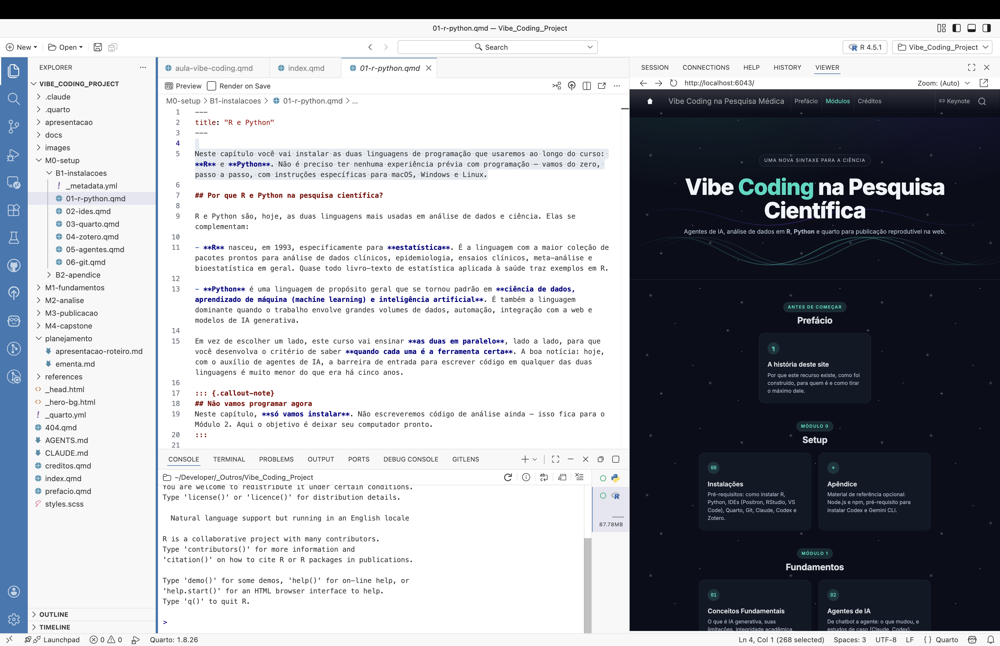

::: {.notes}
Apresentação pessoal curta. "Hoje a gente vai falar de uma forma diferente de fazer análise de dados — uma forma que praticamente não existia há dois anos e que mudou como eu trabalho. Não vou ensinar a programar nesta aula. Vou mostrar uma ideia."
:::

## O que é Vibe Coding {.center}

Você descreve.\
A IA escreve o código.

{.placeholder fig-align="center"}

::: {.notes}
O termo "vibe coding" foi popularizado em 2025. A ideia é que o pesquisador descreve em português o que quer fazer (importar uma planilha, calcular médias, comparar grupos, fazer um gráfico) e um agente de IA escreve o código. Você não precisa decorar sintaxe. Você precisa saber o que quer. Isso muda o pré-requisito da análise: deixa de ser "saber programar" e passa a ser "saber descrever sua pesquisa".
:::

## Sua pesquisa {.center}

200 pacientes.\
30 variáveis.

{.placeholder fig-align="center"}

::: {.notes}
Vamos imaginar uma pesquisa qualquer — não importa a área. Você tem um banco de dados clínico, vai fazer uma análise, escrever um artigo. Vou descrever um fluxo que provavelmente todo mundo aqui já viveu.
:::

## SPSS → Word {.center}

{.placeholder fig-align="center"}

::: {.notes}
A maneira clássica: você roda a análise no SPSS (ou Stata, ou JASP, ou Excel). Pega a tabela de saída, copia. Cola no Word. Salva o gráfico como imagem. Insere no Word. Reformata para caber. Repete. Ao fim do dia, você tem um documento. Funciona — mas tem um problema invisível.
:::

## "Refaz tirando os menores de 18." {.center}

{.placeholder fig-align="center"}

::: {.notes}
Aí o orientador, ou o revisor, ou você mesmo um mês depois pede uma mudança simples: tira os menores de 18, ou troca um teste estatístico, ou inclui um novo desfecho. Em código, isso é uma linha mudada. No fluxo tradicional…
:::

## Refazer tudo. Manualmente. {.center}

{.placeholder fig-align="center"}

::: {.notes}
Você roda a análise de novo. Apaga as tabelas antigas do Word. Cola as novas. Apaga as figuras. Cola as novas. Reformata tudo. E reza para não ter esquecido nenhuma. É hora perdida — e é onde os erros entram.
:::

## Tabela 3 ainda tem o número antigo. {.center}

{.placeholder fig-align="center"}

::: {.notes}
A Tabela 3 ficou com o n da análise anterior. O p-valor do gráfico não bate com o do texto. A figura é da versão antiga porque você esqueceu de re-exportar. Esse tipo de inconsistência é mais comum do que se admite, e é uma das fontes silenciosas de erros em artigos médicos. Não é falta de cuidado. É um workflow frágil.
:::

## E se a análise *fosse* o documento? {.center}

::: {.r-fit-text}
?
:::

::: {.notes}
Aqui vem a virada. E se o texto que você escreve, o código da análise e os resultados (tabelas, gráficos) vivessem no mesmo arquivo? E se mudar o código atualizasse automaticamente todas as tabelas e figuras do artigo, sem você tocar em nada?
:::

## Quarto {.center}

texto + código + saída

{.placeholder fig-align="center"}

::: {.notes}
Esse é o Quarto. Um formato de documento desenvolvido pela Posit — a mesma empresa do RStudio. O arquivo .qmd mistura três coisas: o texto que você escreve em Markdown, blocos de código em R ou Python, e a saída do código (tabelas, gráficos, números). Quando você renderiza, o Quarto executa o código e insere o resultado no lugar certo do documento. Tudo ao vivo.
:::

## Anatomia de um `.qmd`

````markdown
---
title: "Estudo de coorte"
---

## Resultados

A média de idade foi de:

```{{r}}
mean(dados$idade)
```
````

::: {.notes}
A anatomia é simples. Em cima, um bloco de metadados — título, autor. No meio, texto comum (Markdown — você aprende em quinze minutos). E os blocos de código entre crases triplas. Quando o documento é renderizado, o `mean(dados$idade)` é substituído pelo número real. Se os dados mudam, o número muda. Sozinho.
:::

## Positron {.center}

{.placeholder fig-align="center"}

::: {.notes}
Aqui está o Positron — o IDE da Posit, sucessor do RStudio. Ele abre o .qmd à esquerda e o preview renderizado à direita. Eu mudo um valor no código, salvo, o preview atualiza. Sem copiar, sem colar. (Mostrar 2-3 mudanças ao vivo se possível, ou narrar o screenshot.)
:::

## Uma mudança. Tudo refeito. {.center}

{.placeholder fig-align="center"}

::: {.notes}
Volta ao orientador querendo tirar os menores de 18. No Quarto, isso é uma linha de código: `filter(idade >= 18)`. Salvo. Renderizo de novo. Tabela 1, Tabela 3, Figura 2, todas se atualizaram juntas, com o n correto, com o p-valor correto, com os números do texto correto. Não tem como esquecer.
:::

## `.qmd` → HTML, PDF, Word, slides {.center}

{.placeholder fig-align="center"}

::: {.notes}
O mesmo .qmd exporta para múltiplos formatos. Site na web? format: html. PDF para submeter na revista? format: pdf. Word porque o coorientador só revisa em Word? format: docx. Slides para apresentar em congresso? format: revealjs. O conteúdo é o mesmo. Você não escreve quatro versões — você escreve uma.
:::

## E o código? Quem escreve? {.center}

{.placeholder fig-align="center"}

::: {.notes}
Aí volta a dúvida que provavelmente todos aqui têm: "tudo isso parece ótimo, mas eu não sei R nem Python." Resposta: você não precisa.
:::

## Claude Cowork {.center}

Você descreve.\
Ele escreve.

{.placeholder fig-align="center"}

::: {.notes}
O Claude Cowork é um agente de IA — não um chatbot. A diferença: ele não só responde, ele executa no seu computador. Ele cria arquivos, escreve código, roda análises. Você fala em português o que quer ("compare a idade entre os dois grupos com teste t e me dê uma tabela"), ele escreve o .qmd correspondente e renderiza para você ver.
:::

## Conversa → arquivo `.qmd` pronto {.center}

{.placeholder fig-align="center"}

::: {.notes}
(Demo ao vivo se possível, ou narrar o screenshot.) O Cowork não é um chatbot que sugere código pra você copiar. Ele cria o arquivo. Salva. Roda. Mostra o resultado. Se você pede uma mudança, ele edita o arquivo. Se algo falha, ele lê o erro e corrige. O papel do pesquisador deixa de ser "escrever código" e passa a ser "saber pedir e validar".
:::

## Dado bruto → análise → artigo {.center}

em um arquivo

{.placeholder fig-align="center"}

::: {.notes}
Esse é o loop fechado da pesquisa reprodutível. Do dado bruto à figura na revista, sem perder rastreabilidade. Daqui a dois anos, quando o revisor pedir uma análise adicional, você abre o .qmd, muda uma linha, renderiza. Cinco minutos. E fica documentado o que mudou.
:::

## Vibe Coding na Pesquisa Científica {.center}

Curso completo

henriquealvarenga.com/vibe-coding

{.placeholder fig-align="center"}

::: {.notes}
Tudo isso vai mais fundo num curso que estou montando: Vibe Coding na Pesquisa Científica. São seis módulos — Setup, Trabalhando com IA, Fundamentos técnicos, Análise de dados, Publicação e reprodutibilidade, e um projeto final. Conteúdo aberto, no site. Encerrar com convite a perguntas.
:::
